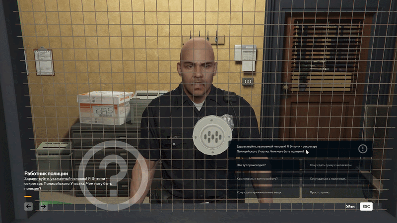
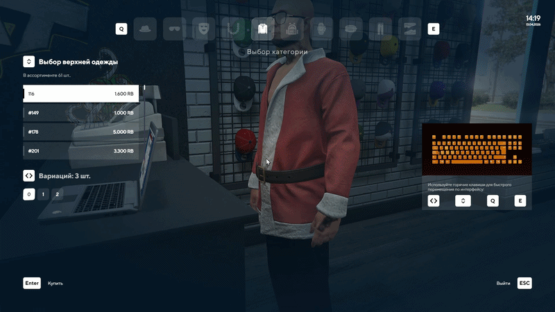

# 🚀 RedAge v3 Server (NeptuneEvo)


Полностью настроенный сервер на базе RedAge v3 для RAGE:MP.
Сервер с кастомной логикой, системой фич и возможностью дальнейшего развития.

---

## 🎥 Демонстрация


### 🚗 Автошкола



### 👕 Система одежды



### 🌍 Игровой процесс


---

## ✨ Основные фичи

* 🚗 **Система автошколы** (теория + маршруты)
* 👕 **Система одежды** (компоненты, вариации, цвета)
* 💰 **Экономика и финансы** (банк, наличка, операции)
* 🏢 **Фракции и организации**
* 📦 **Инвентарь и предметы**
* 🚕 **Система заказов (Taxi / Phone)**
* 🚓 **Система полиции и чекпоинтов**
* 🎯 **Работы, бизнесы, активности**
* 🌍 **Поддержка кастомных карт и DLC**
* 🔧 **Гибкая конфигурация через JSON и БД**

---

## 📦 Стек технологий

* **RAGE:MP**
* **.NET Core**
* **Node.js / Webpack**
* **MariaDB**
* **Redis**

---

## ⚙️ Установка

```bash
git clone <repo-url>
cd redage_v3
```

### Клиент

```bash
cd src_client
npm install
npm run build
```

### База данных

Создать:

* `ra3_main`
* `ra3_mainconfig`
* `ra3_mainlogs`

Импортировать `.sql` из `database/`

---

### Запуск

```bash
cd ragemp-srv
./ragemp-server
```

---

## 📁 Структура проекта

```
dotnet/        # Сервер (.NET)
src_client/    # Клиент JS
src_cef/       # UI
database/      # SQL
settings/      # Конфиги
json/          # Данные
maps/          # Карты
plugins/       # Плагины
```

---

## ⚠️ Важно

Не пушить:

* node_modules/
* bin/
* obj/

---

## 🛠️ Dev команды

```bash
# screen
screen -S ragemp
./ragemp-server

# вернуться
screen -r ragemp
```

---

## 💬 История проекта

Когда-то это начиналось с:

> “почему MongoDB не подключается на localhost?”
> "Этим кстати и закончилось))"

## Автор

вчерашний школьник со сломанной MongoDB
INT https://drive.google.com/file/d/1dzBjvkB5d6V9hH2Pafza_D14NGDZBxb8/view
